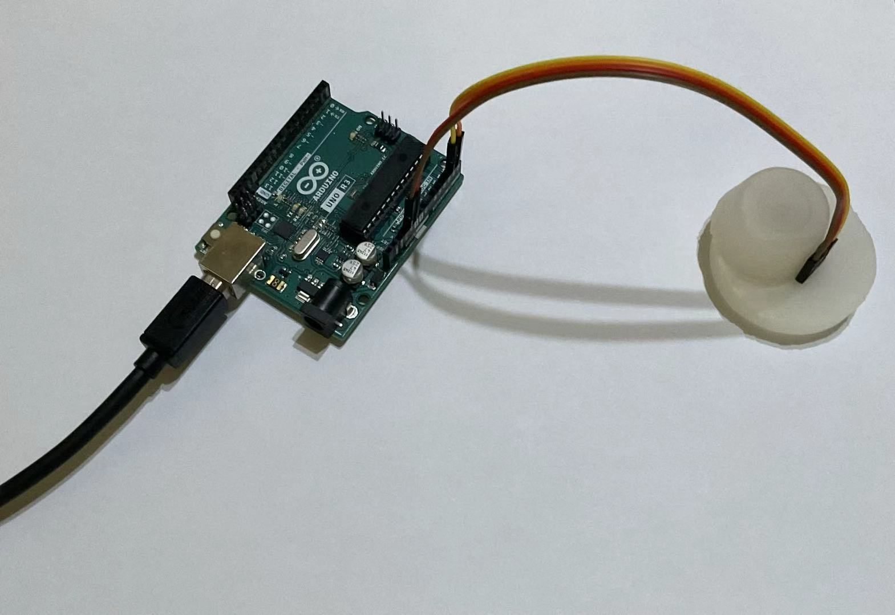
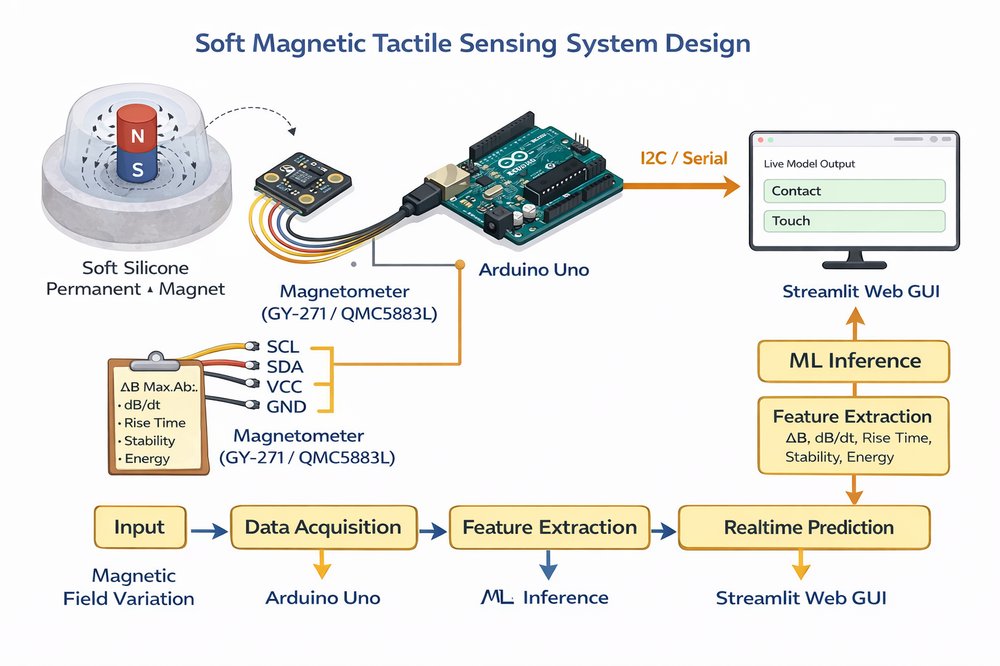

# Magnetic Tactile Sensing Prototype (Low-Cost, Interpretable)  
# 低成本可解释磁触觉传感原型系统

---

## 📸 System Overview / 系统实物图



> **Figure / 图示：** Arduino Uno + GY-271 磁传感器 + 嵌入磁铁的软硅胶结构

---

## 🧩 System Design / 系统结构设计



> **Figure / 图示：** End-to-end pipeline of the soft magnetic tactile sensing system, including sensing, data acquisition, feature extraction, and real-time inference.  
> 软体磁触觉传感系统的完整流程，包括感知、数据采集、特征提取以及实时推理。  
> ⚠️ Design diagram generated with AI for illustration purposes only.  
> ⚠️ 设计图由AI生成，仅供示意。

---

## Overview / 项目简介

**EN**  
This project implements a low-cost magnetic tactile sensing system using a soft silicone structure, a magnetometer module, and real-time machine learning inference.

**zh**  
本项目实现了一个低成本磁触觉传感系统，利用软硅胶结构、磁传感器以及实时机器学习进行触觉识别。

---

## Key Idea / 核心原理

**EN**

- External force deforms silicone  
- Embedded magnet shifts position  
- Magnetic field changes  
- Sensor captures variation  
- ML model classifies interaction  

**zh**

- 外力作用使硅胶发生形变  
- 磁铁位置发生变化  
- 磁场分布改变  
- 传感器检测磁场变化  
- 机器学习模型进行分类  

---

## Capabilities / 功能

- Detect **contact vs no-contact** / 接触检测  
- Distinguish **touch vs press (punch)** / 区分轻触与按压  
- Real-time inference / 实时识别  
- Interpretable ML (XAI) / 可解释性分析  

---

## System Architecture / 系统架构

```text
Silicone + magnet
        ↓
Magnetometer (GY-271)
        ↓
Arduino (Serial)
        ↓
Python (feature extraction)
        ↓
ML model (sklearn)
        ↓
Streamlit Web UI
```

---

### Design Highlights / 设计特点

Soft Structure / 软体结构

EN
The magnet is embedded inside silicone, enabling continuous deformation sensing.

zh
磁铁嵌入软硅胶中，实现连续形变感知。

---

## Minimal Hardware / 极简硬件
	•	No custom PCB / 无需定制电路板
	•	Off-the-shelf components / 使用现成器件

---

## Real-Time ML / 实时机器学习
	•	Sliding window feature extraction / 滑动窗口特征提取
	•	Two-stage classification / 两阶段分类

---

## Data Collection Strategy / 数据采集策略

EN
Data was collected under natural interaction variability:
	•	Random touch direction
	•	Varying angles
	•	Non-uniform pressure

This reduces consistency but improves robustness and real-time sensitivity.

zh
数据采集采用自然交互方式，包括：
	•	随机触摸方向
	•	不同角度
	•	非均匀压力

虽然降低一致性，但提升了系统鲁棒性与实时灵敏度。

---

## Machine Learning Pipeline / 机器学习流程

Tasks / 任务
	1.	Contact detection / 接触检测
	2.	Touch vs punch classification / 轻触 vs 按压

---

Features / 特征
	•	Magnetic magnitude (B)
	•	Relative change (dB)
	•	Peak value
	•	Dynamic response (dB/dt)
	•	Rise time
	•	Energy
	•	Stability

---

## Explainability (XAI) / 可解释性分析

EN
SHAP is used to analyze model behavior and feature importance.

zh
使用 SHAP 对模型进行可解释性分析，包括特征重要性和决策依据。

---

## Project Structure / 项目结构
```
.
├── README.md
├── requirements.txt
├── start.sh
├── app.py
├── realtime_inference_app.py
├── train_baseline.py
├── explain_shap.py
├── assets/
│   ├── setup.jpg
│   └── system_design.png
├── arduino/
│   └── magnetometer_csv.ino
├── data/
├── outputs/
└── explanations/
```

---

## Relative Paths / 相对路径说明

EN
This repository uses relative paths to ensure portability across systems.

zh
本项目使用相对路径，便于在不同设备环境中直接运行。

---

## Installation / 安装
```
chmod +x ./bootstrap_and_run.sh
./bootstrap_and_run.sh --csv ./data/your_data.csv

```
---

## Usage / 使用流程

1. Upload Arduino Code / 上传Arduino程序
```
./arduino/magnetometer_csv.ino
```

---

2. Collect Data / 数据采集
```
streamlit run ./app.py
```

---

3. Train Model / 模型训练
```
python ./train_baseline.py --csv ./data/your_data.csv --outdir ./outputs
```

---

4. Real-Time Inference / 实时推理
```
streamlit run ./realtime_inference_app.py
```

---

5. SHAP Explainability / 可解释性分析
```
python ./explain_shap.py \
  --features ./outputs/segment_features.csv \
  --model ./outputs/contact_vs_no_contact_logreg.joblib \
  --outdir ./explanations
```

---

## Limitations / 局限性
	•	Single magnet design / 单磁体设计
	•	Limited spatial resolution / 空间分辨率有限
	•	Sliding window latency / 存在时间窗口延迟
	•	No calibration across devices / 未进行设备间校准

---

## Future Work / 未来工作
	•	Multi-sensor array / 多传感器阵列
	•	Improved mechanical structure / 结构优化
	•	Deep learning models / 深度学习模型
	•	Robotics integration / 机器人应用

---

## AI Assistance Statement / AI辅助声明

EN
This project was developed with the assistance of AI-based tools for code structuring, documentation drafting, and workflow refinement. All hardware design, experimental setup, data collection, debugging, and model validation were performed by the author.

zh
本项目在代码结构设计、文档撰写和开发流程优化过程中使用了AI工具辅助，但所有硬件设计、实验搭建、数据采集、调试及模型验证均由作者完成。

---

License / 许可证

MIT License

---

## Notes / 说明

EN
This project is a simplified and interpretable redesign rather than a direct replication of existing systems.

zh
本项目为简化且强调可解释性的重新设计，并非对现有系统的直接复现。
